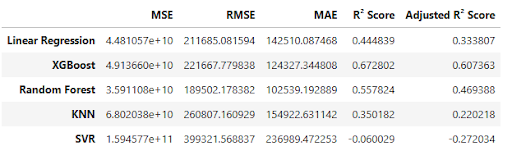
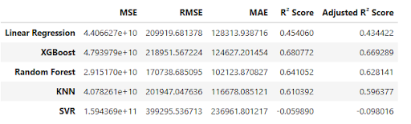
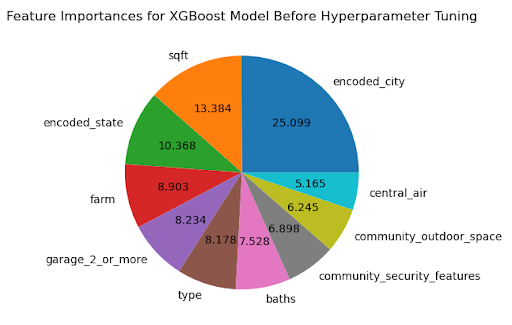
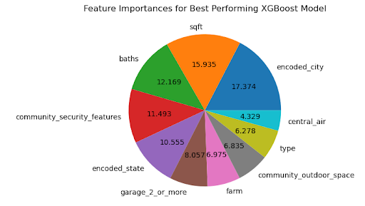
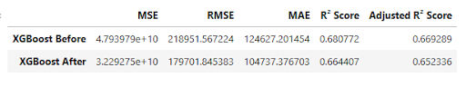

 # Data Science Midterm Project

## Project Goals
The goal of this project is to compare various machine learning models, then use the most best perfoming model to predict the selling price of real estate property listings.  

#### Predictive Features:
- `year_built`
- `garage`
- `stories`
- `beds`
- `baths`
- `sqft`
- `lot_sqft`
- `city`
- `state`
- `tags`
#### Target variable: sold_price
#### Models Used:
- Linear Regression
- XGBoost
- Random Forest
- K-Neighbors Regressor (KNN)
- Support Vector Regression (SVR)

## Process
### Extracting JSON data
- Looped over all JSON data, filtering records with no listings, loaded and saved to Pandas Dataframe for cleaning 
- Loaded the data into a Pandas DataFrame for further cleaning and preprocessing.
### Data Preparation  
#### Handling Missing Data: 
- The 4 columns with the most (>70%) missing data were removed, as well as irrelevant columns and rows whre the target is null.
- Null values for features such as `stories`, `garage`, `beds` etc were imputed with 0
- Null values for the `year_built` column was imputed based on the `type` column:
  - there were many entries of `single_family` type, entries were grouped by city, then imputed with the most frequently occuring year for the listing
  - `land` and `condo` types only had one entry each in the whole dataframe, so null values where imputed according to the single entry
  - there were only 2 entries of `other` type, and they were removed upon manual inspection of being incomplete
  - The remaining few entries were imputed by manual search, or removed if manual search yielded no results
#### Encoding Categorical Columns:
- Encode_tags function was applied with minimum occurance of 100
- `City` and `state` columns were encoded using `TargetEncoder` from the `category_encoder` module to account for both the group and global mean 
#### Feature Engineering: 
- `Total sqft`: sum of `sqft` and `lot_sqft`
- `building_ratio`: ratio of house sqft to lot sqft, higher ratio = more building area, 0 = all lot no building
#### Feature Selection 
- Used sklearn RFE to recursively select the top 10 features:
### Model testing 
- Conducted train/test split before initiating and fitting each model
- Computed and compared evaluation metrics 
### Hyperparameter Tuning 
- Used RandomizedSearchCV to find best hyperparameters for best performing model from step above

## Results
#### Evaluation metrics before feature selection:

#### Evaluation metrics after feature selection:

#### XGBoost feature importances before hyperparameter tuning:

#### XGBoost feature importances after hyperparameter tuning:

Among all the models teseted, the XGBoost model had the best evaluation metrics. It has the lowest Mean Absolute Error, as well as the highest R^2 and adjusted R^2 values. After tuning hyperparameters, the four features that have the most effect on predicting the target are `sqft`, `encoded_city`, `baths`, and `community_security_features`

#### Evaluation metrics before/after hyperparameter tuning:

After hyperparameter tuning, the best model outputs a lower RMSE and MAE and a slightly lower R^2 value. 

## Challenges and Limitations 
### Data Processing 
It took some thought to determine the best way to impute missing values for the `year_built` column. Ultimately it was done using the grouped city/state mode or the value of the single entry in the dataframe. This sort of imputation will result in the model having less variability. 

## Future Goals
A next step for this project would be to test the model and predict on a new set of data. Implementing external datasets such as city/statte climate or economy information can also be used to construct a more robust model. 
